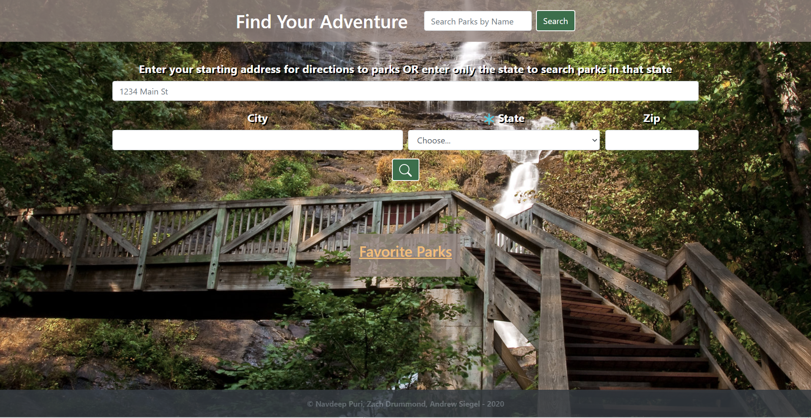
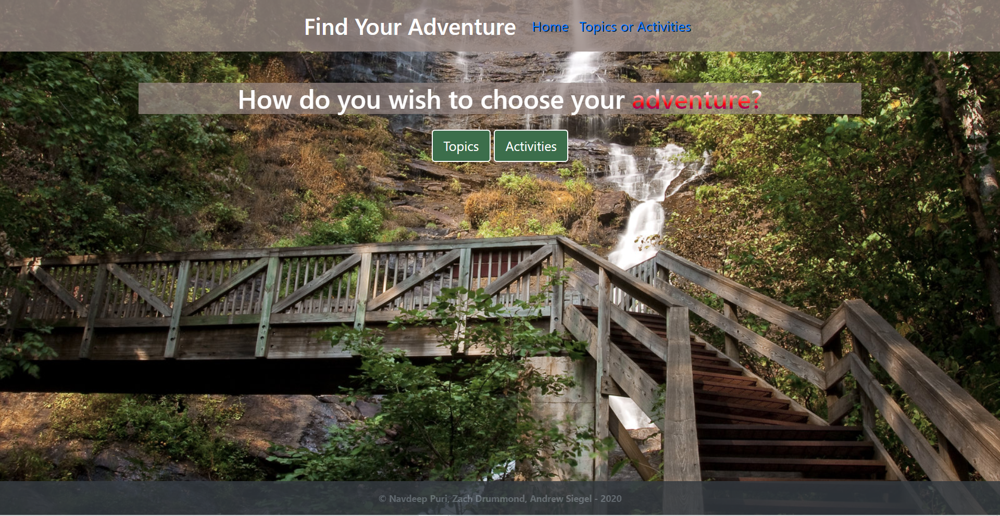
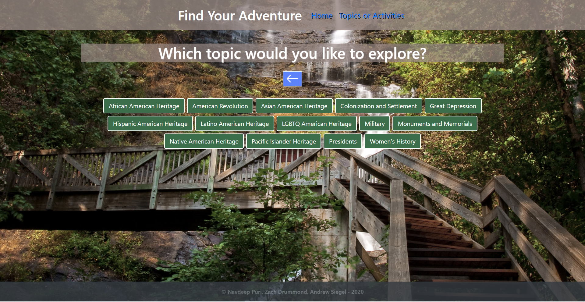
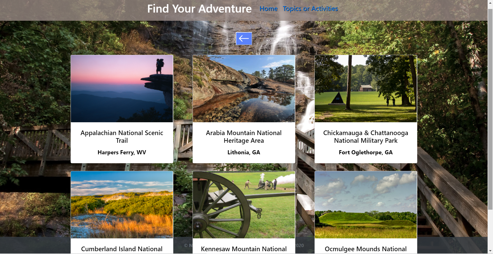
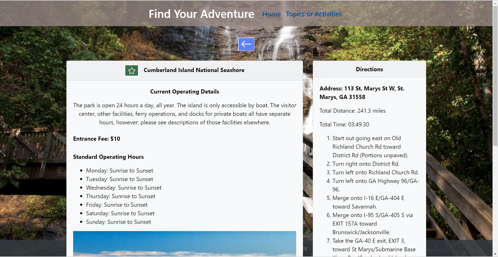
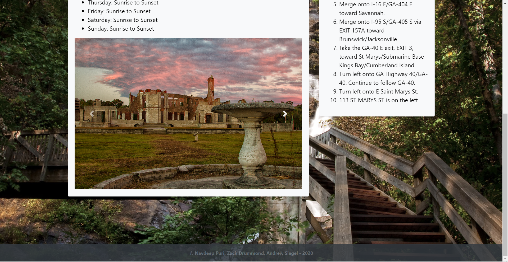

# Find-Your-Paradise

Thank you very much for taking the time to view our web-app! We hope you are able to swiftly navigate through the interface and get to your National Park of choice as soon as possible! Make sure you plan your gear, supplies, and clothing according to the conditions at the specific park, especially for longer trips. Have a great time and enjoy your adventures!!

## Table of Contents

- [Description](#Description)
- [Design Elements](#Design-Elements)
- [App Preview](#App-Preview)
- [Links](#Links)
- [Credits](#Credits)

## Description

This is an app that will display a list of national parks based on the user’s location and preferences, including all of the information the user needs to know about the park.
In this day and age,

### _Usage_

- Search Form

  1. Enter your starting address or a state and click the search button.
  2. Choose a button to advance: topic or activity.
  3. Choose a topic you would like to learn about or an activity you would like to do inside of a national park.
  4. Choose a National Park that meets the criteria you are searching for.
  5. Click the star button if you want to favorite that national park.

- Search Bar

  1. Enter the name of a national park and click the search button.
  2. Choose a National Park that meets the criteria you are searching for.
  3. Click the star button if you want to favorite that national park.

- Favorite Parks

  1. Click a favorite park to go to the specific details page about that park.

- Extra Buttons
  - Click the home button to return to the home page.
  - Click the "Topics or Activities" button to go to the Topics or Activities page.
  - Click the back arrow button if you need to go back a page.
  - Click the star button if you want to favorite a national park.

## Links

- Website: https://siegelal7.github.io/Find-Your-Adventure/
- GitHub Repository: https://github.com/siegelal7/Find-Your-Adventure

## Design Elements

We chose to design our web-app using only one url and using DOM manipulation and event listeners to change the content on demand.

### _JavaScript_

- Clean User Interface
- Server-Side APIs
- API Key
- Parameter Queries
- Dynamically Updated HTML and CSS powered by jQuery
- Document Object Model Manipulation
- Local Storage
- JSON
- AJAX
- Logical Code Structure
- Sequential Order
- Objects
- Arrays
- Methods
- Global and Local Variables
- Functions
- Event Listeners
- if...else Statements
- for Loops
- Comments

### _Bootstrap_

- Grid System
- Navbar
- Cards
- Form
- Sizing
- Spacing

### _HTML_

- Logical Structure
- Sequential Order
- Bootstrap CSS Link
- CSS File Link
- JavaScript File Link
- Concise Descriptive Title
- Semantic Elements
- ids, Classes, and Elements
- Buttons
- Comments

### _CSS_

- Comments

## App Preview

### Home Page

### Home Page with Favorites

### Topics or Activities

### Topics Page

### Activities Page

### List of Parks Page

### Specific Park Page

## Credits

### _Sources_

- National Park Service API - https://www.nps.gov/subjects/digital/nps-data-api.htm
- MapQuest API - https://developer.mapquest.com/
- jquery - https://api.jquery.com/
- Bootstrap: https://getbootstrap.com/

### _Collaborators_

- Navdeep Puri - https://github.com/NavdeepDP
- Andrew Siegel - https://github.com/siegelal7
- Zach Drummond - https://github.com/zachdrummond

## License

Copyright (c) 2020 Navdeep Puri, Zach Drummond, Andrew Siegel

Permission is hereby granted, free of charge, to any person obtaining a copy
of this software and associated documentation files (the "Software"), to deal
in the Software without restriction, including without limitation the rights
to use, copy, modify, merge, publish, distribute, sublicense, and/or sell
copies of the Software, and to permit persons to whom the Software is
furnished to do so, subject to the following conditions:

The above copyright notice and this permission notice shall be included in all
copies or substantial portions of the Software.

THE SOFTWARE IS PROVIDED "AS IS", WITHOUT WARRANTY OF ANY KIND, EXPRESS OR
IMPLIED, INCLUDING BUT NOT LIMITED TO THE WARRANTIES OF MERCHANTABILITY,
FITNESS FOR A PARTICULAR PURPOSE AND NONINFRINGEMENT. IN NO EVENT SHALL THE
AUTHORS OR COPYRIGHT HOLDERS BE LIABLE FOR ANY CLAIM, DAMAGES OR OTHER
LIABILITY, WHETHER IN AN ACTION OF CONTRACT, TORT OR OTHERWISE, ARISING FROM,
OUT OF OR IN CONNECTION WITH THE SOFTWARE OR THE USE OR OTHER DEALINGS IN THE
SOFTWARE.
